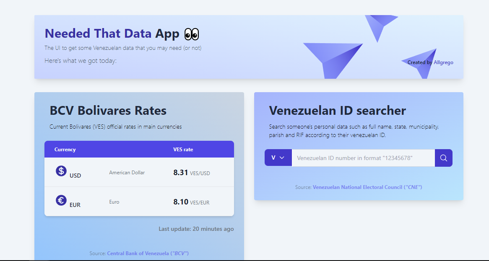

# Needed That Data App

  

UI to consume the [Needed That Data API](https://github.com/allgrego/needed-that-data). Thus, providing some official venezuelan data such as full name based on venezuelan ID ("cédula") or the current BCV rates in VES.

Made with Next.js, Typescript and Tailwind.

  
  
## Demo
The application is available on [Needed That Data UI](https://needed-that-data.vercel.app/)

